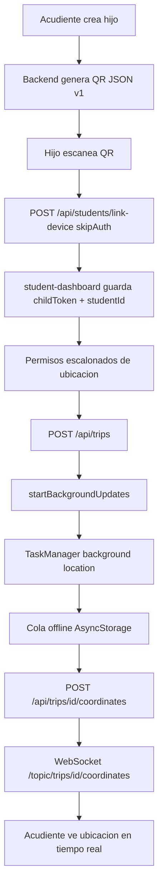

# Auditoria UI, onboarding, QR y background location

## Diagrama de flujo



## Contrato de endpoints

### `POST /api/students/{id}/link-codes`

Genera un codigo temporal para vincular el celular del hijo.

Request:

```json
{
  "ttlMinutes": 15
}
```

Response:

```json
{
  "code": "AB12CD34",
  "exp": "2026-10-06T19:15:00.000Z"
}
```

Notas: TTL recomendado 10-15 minutos, codigo de un solo uso, revocar codigos anteriores al emitir uno nuevo.

### `POST /api/students/link-device`

Vincula el celular del hijo. Se llama con `skipAuth: true`.

Request:

```json
{
  "studentId": "student-uuid-opcional-para-qr-v1",
  "code": "AB12CD34",
  "deviceIdentifier": "student-device-uuid",
  "platform": "android",
  "deviceName": "Pixel 8"
}
```

Response:

```json
{
  "childToken": "jwt-limitado",
  "studentId": "student-uuid",
  "linkedDevices": 1
}
```

Notas: `childToken` debe tener alcance limitado: iniciar trayecto, enviar coordenadas y consultar perfil propio. No debe permitir operaciones de acudiente.

### `POST /api/trips`

Inicia un trayecto escolar.

Request:

```json
{
  "studentId": "student-uuid",
  "tripStartedAt": "2026-10-06T19:00:00.000Z"
}
```

Response:

```json
{
  "tripId": "trip-uuid"
}
```

### `POST /api/trips/{id}/coordinates`

Recibe coordenadas del hijo. Puede aceptar batch en una version posterior.

Request:

```json
{
  "latitude": 4.71099,
  "longitude": -74.07209,
  "timestamp": "2026-10-06T19:01:15.000Z",
  "accuracy": 12
}
```

Response:

```json
{
  "ok": true
}
```

Contrato actual de app: envia `latitude`, `longitude`, `accuracy`, `altitude`, `heading`, `speed`, `recordedAt`.

## Politica de permisos

- Foreground: "Permite que GPS Guardian Escolar use tu ubicacion durante el trayecto escolar."
- Background: "Permite que GPS Guardian Escolar comparta la ubicacion del trayecto escolar con tu acudiente."
- Android 13+: se solicita permiso de notificaciones para mostrar el foreground service.
- Si el permiso falla, `PermissionGate` muestra una instruccion en espanol para ir a Ajustes.
- El rastreo se activa solo con "Iniciar trayecto" y se detiene con "Finalizar trayecto".

## Justificacion de background location

GPS Guardian Escolar usa ubicacion en segundo plano solo durante el trayecto escolar para que el acudiente pueda verificar seguridad y avance de ruta. El hijo inicia y finaliza el rastreo manualmente, Android muestra una notificacion persistente y iOS muestra el indicador de ubicacion. No se recolecta ubicacion fuera del trayecto.

## Riesgos y mitigaciones

- Android Doze: usar foreground service, intervalo por distancia de 25 m y recomendar excluir optimizacion de bateria si el colegio lo requiere.
- iOS mata proceso: inicio/final explicitos, `UIBackgroundModes: ["location"]` y reanudacion al abrir el dashboard.
- Rechazo de stores: justificar uso escolar, mostrar UI previa de contexto, usar notificacion persistente y limitar rastreo al trayecto.
- QR legacy: `parseQrValue` mantiene retrocompatibilidad con deep-link antiguo.
- Token hijo amplio: backend debe emitir JWT de alcance limitado y corta duracion renovable.
- Red intermitente: cola offline en AsyncStorage, reintentos con backoff y flush al recuperar red o finalizar trayecto.

## Checklist de pruebas en dispositivo real

- [ ] Onboarding skip + no se repite (version 2)
- [ ] Onboarding version 3 (cambio de copy) se muestra de nuevo
- [ ] QR acudiente -> scan hijo -> vinculo exitoso
- [ ] Codigo manual funciona si camara falla
- [ ] Android: notificacion FGS + coords con app minimizada / pantalla off
- [ ] iOS: permiso "Siempre" + indicador azul
- [ ] Cola de coords se vacia al recuperar red
- [ ] Acudiente ve actualizacion por WebSocket
- [ ] Justificacion de ubicacion visible (Play / App Store)
- [ ] Sin colores hardcodeados en pantallas migradas
- [ ] Touch targets >=48dp
- [ ] Contraste AA en textos
- [ ] accessibilityLabel en botones criticos
- [ ] Probar en 2 Android + 1 iPhone
